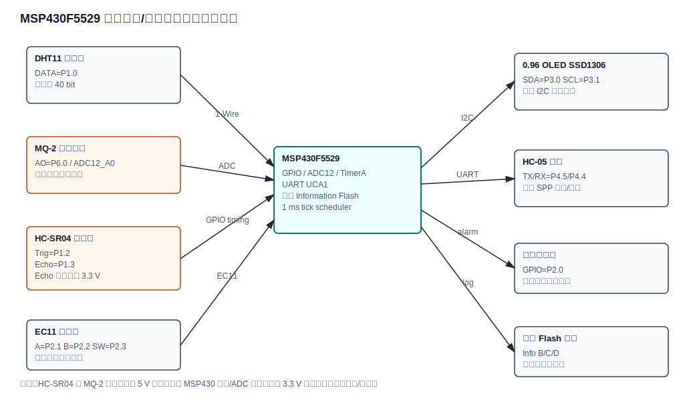
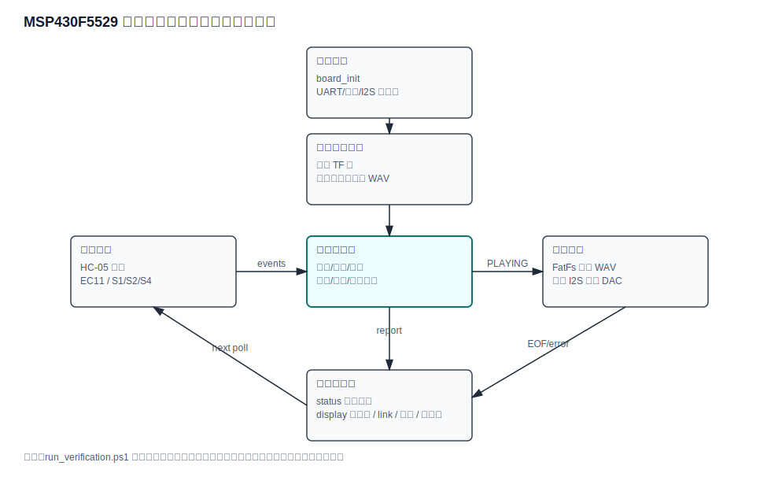

# 单片机技术课程设计报告：蓝牙遥控音频播放器

## 1. 课题与平台

- 课题名称：蓝牙遥控音频播放器
- 主控平台：TI MSP430F5529 LaunchPad
- 固件版本：1.4.0
- 手机端：Android 原生 Java 蓝牙 SPP 控制 APK
- 外设：HC-05、TF 卡座、PCM5102A I2S DAC、PAM8403 功放、EC11 旋转编码器、3.5mm 耳机座、本地按键

## 2. 设计目标

本设计实现 TF 卡 WAV 音频读取、软件 I2S 数字音频输出、手机蓝牙遥控、本地旋钮/按键控制、状态显示和自动化验证。手机端可发送播放/暂停、停止、重播、上一曲、下一曲、音量加减、静音、播放顺序切换、曲目扫描、自检、显示帧查询等串口命令。

## 3. 系统总体方案

系统采用分层结构：

- 应用层：`application/audio_player.*` 维护播放器状态机、蓝牙命令、曲目切换、音量和播放顺序。
- 驱动层：`drivers/` 负责 MSP430 时钟、UART、EC11、本地按键、软件 I2S 和板级 GPIO。
- 中间层：`middleware/wav_reader.*` 解析 16-bit PCM WAV，`middleware/display_model.*` 生成三行状态显示帧。
- 文件系统：`fatfs/` 提供 TF 卡 FAT 文件访问。
- 手机端：`android/` 通过 HC-05 SPP 发送命令并解析 `status=` 和 `display 1/2/3:` 回传。
- 验证工具：`tools/` 提供固件构建、注释规范检查、协议仿真、Android 解析仿真、音频流仿真、整板场景仿真、按键长按仿真、墨水屏预览、软件效果验收报告和交付打包。
- TF 卡测试音：`tools/prepare_sdcard_assets.py` 生成，`tools/wav_asset_check.py` 按 RIFF chunk 校验。

系统硬件框图见下图：



## 4. 硬件连接

核心引脚分配：

| 模块 | 连接 |
| --- | --- |
| TF 卡 | CS=P4.0，SCK=P3.1，MOSI=P3.2，MISO=P3.3 |
| PCM5102A | BCK=P4.1，LRCK=P4.2，DIN=P4.3 |
| EC11 | A=P2.1，B=P2.2，SW=P2.3 |
| 本地按键 | S1=P1.2，S2=P1.3，S4=P2.6 |
| HC-05 | RXD<-P4.4，TXD->P4.5 |
| 状态 LED | P1.0 |

课程资料中 HC-05 和 TF 卡 MISO 都涉及 P3.3。为了避免同一引脚冲突，本工程默认将 HC-05 改到 UCA1 的 P4.4/P4.5，保证 TF 卡和蓝牙可同时工作。

## 5. 主要功能

- TF 卡根目录读取 `TRACK01.WAV` 到 `TRACK09.WAV`。
- 支持 16-bit PCM WAV，单声道自动复制到左右声道，双声道直接输出。
- 软件 I2S 输出到 PCM5102A，模拟音频可接 PAM8403 和耳机座。
- Android APK 蓝牙控制播放、暂停、停止、重播、音量、静音、上下曲、曲目选择和播放顺序。
- EC11 旋转调节音量，按键播放/暂停。
- S1/S2/S4 支持短按和长按：短按播放/暂停、上一曲、下一曲；长按停止、静音、播放顺序。
- 蓝牙 `t` 命令输出 DAC 测试音，便于现场确认 DAC/功放/喇叭链路。
- 蓝牙 `d` 命令输出三行显示帧；Android 面板和 PGM 预览图可模拟墨水屏效果。
- 蓝牙状态包含播放模式、曲目、音量、播放顺序、采样率、声道和进度百分比。

软件主流程见下图：



## 6. 蓝牙命令协议

| 命令 | 功能 |
| --- | --- |
| `p` | 播放/暂停 |
| `s` | 停止 |
| `r` | 重播当前曲 |
| `n` / `>` | 下一曲 |
| `b` / `<` | 上一曲 |
| `+` / `=` | 音量加 |
| `-` / `_` | 音量减 |
| `m` | 静音/恢复 |
| `o` | 切换播放顺序 |
| `t` | DAC 测试音 |
| `i` | 固件和硬件映射 |
| `e` | 自检摘要 |
| `l` | 扫描曲目文件 |
| `d` | 三行显示帧 |
| `1` 到 `9` | 直接播放指定曲目 |
| `?` | 查询状态 |

示例回传：

```text
status=playing track=3 volume=19 order=repeat_one rate=16000Hz channels=2 progress=0
display 1:playing T3 V19 ONE
display 2:SD:OK WAV:OPEN
display 3:16000Hz 2ch P0%
```

## 7. 验证证据

| 要求 | 当前实现 | 验证证据 |
| 手机蓝牙播放/暂停 | APK `Play/Pause` 发送 `p` | `tools/bluetooth_protocol_sim.py` |
| 手机蓝牙音量加减 | APK `Vol +`/`Vol -` 发送 `+`/`-` | `tools/bluetooth_protocol_sim.py` |
| 手机蓝牙上一曲/下一曲 | APK `Prev`/`Next` 发送 `b`/`n` | `tools/bluetooth_protocol_sim.py` |
| 手机蓝牙曲目选择 | APK `Track 1-9` 发送 `1-9` | APK 源码检查、协议仿真 |
| 手机蓝牙曲目扫描 | APK `Track List` 发送 `l` | `tools/bluetooth_protocol_sim.py` |
| 手机蓝牙播放顺序 | APK `Order` 发送 `o`，固件循环 sequence/repeat_all/repeat_one | `tools/bluetooth_protocol_sim.py`、`tools/board_scenario_sim.py` |
| EC11 音量和按键 | `drivers/encoder.*` 事件映射到音量和播放/暂停 | `tools/board_scenario_sim.py` |
| 本地按键 | S1/S2/S4 短按映射播放/上一曲/下一曲，长按映射停止/静音/播放顺序 | `tools/board_scenario_sim.py`、`tools/local_button_sim.py` |
| TF 卡 WAV | FatFs + `wav_reader` 支持 16-bit PCM | 固件编译、WAV 解析静态覆盖 |
| TF 卡测试音频 | `tools/prepare_sdcard_assets.py` 生成 TRACK01-03.WAV，并用 RIFF chunk 校验 | `tools/wav_asset_check.py`、`tools/run_verification.ps1` |
| PCM5102A 输出 | 软件 I2S 输出 16-bit stereo frame | 固件编译、`t` 测试音命令、`tools/audio_stream_sim.py` |
| 音频流效果 | TF WAV 按固件读块大小解码为非静音、音量缩放后的 stereo 样本，进度到 100% | `tools/audio_stream_sim.py`、`docs/audio_stream_report.md` |
| 状态显示 | APK 日志、含播放进度的状态面板、自动状态、`d` 三行显示帧 | 协议仿真、APK 构建、APK 源码检查、`tools/android_ui_parser_sim.py`、`docs/effect_acceptance_report.md` |
| 墨水屏扩展 | 未默认接入，保留显示模型、APK 显示帧、PGM 黑白预览并说明引脚冲突 | `tools/epaper_preview_sim.py`、`docs/hardware_verification.md` |
| 硬件框图/软件流程图 | 自动生成 SVG 图并纳入报告和交付包 | `tools/generate_diagrams.py`、`docs/hardware_block_diagram.svg`、`docs/software_flowchart.svg` |
| 课程报告材料 | 自动生成课程设计报告初稿，保留实物验证待补项 | `tools/generate_course_report.py`、`docs/course_report_draft.md` |
| 软件效果验收报告 | 自动汇总蓝牙命令、Android 解析、整板仿真、按键时序、显示帧、音频流和 WAV 资产证据 | `tools/generate_effect_report.py`、`docs/effect_acceptance_report.md` |
| 注释规范 | 自写头文件、声明、define、static 注释 | `tools/firmware_static_check.py` |
| GitHub 仓库 | 已推送到 `dkjsiogu/mspbluetooth` | `git remote -v` / GitHub |

自动验证命令：

```powershell
powershell -ExecutionPolicy Bypass -File tools\run_verification.ps1
powershell -ExecutionPolicy Bypass -File tools\verify_android_apk.ps1
powershell -ExecutionPolicy Bypass -File tools\package_release.ps1
```

验证覆盖固件 clean build、RAM 余量、头文件/源码注释规范、关键命令、引脚冲突说明、蓝牙协议仿真、Android 状态/显示帧解析仿真、音频流仿真、整板场景仿真、本地按键长按仿真、墨水屏预览图生成、软件效果验收报告生成、TF WAV 资产格式校验、Android APK 构建和权限检查。

## 8. 实物验收计划

实物验收按 `docs/hardware_verification.md` 执行：

- 先只烧录 MSP430F5529，确认 P1.0 状态 LED 和无复位循环。
- 接 HC-05，使用 APK 连接并测试 `?`、`i`、`e`、`l`、`d`。
- 接 PCM5102A/PAM8403/喇叭，先用 `t` 测试音确认音频链路。
- 插入 TF 卡并放置 `TRACK01.WAV` 等文件，测试播放、暂停、上下曲和进度上报。
- 测试 EC11、本地短按和长按。
- 将结果填写到 `docs/test_record.csv`。

## 9. 风险与说明

当前软件构建、APK 构建和仿真验证已完成；真实烧录、HC-05 实连、TF 卡实读、DAC 出声、功放和 EC11/按键手感仍需在 MSP430F5529 实物上确认。墨水屏默认不接入固件，因为参考墨水屏方案与 TF/I2S/EC11 引脚存在冲突；本工程通过显示模型、Android 面板和 `docs/epaper_preview.pgm` 预览图保留显示效果验证。

## 10. 总结

本项目围绕蓝牙遥控音频播放主线完成了音频文件读取、WAV 解析、软件 I2S 输出、手机遥控、本地控制、状态显示和自动化验证闭环。代码按应用、驱动、中间件、文件系统和工具分层，关键头文件、声明、宏和静态函数均保留说明，便于课程答辩、调试和后续上板验证。
